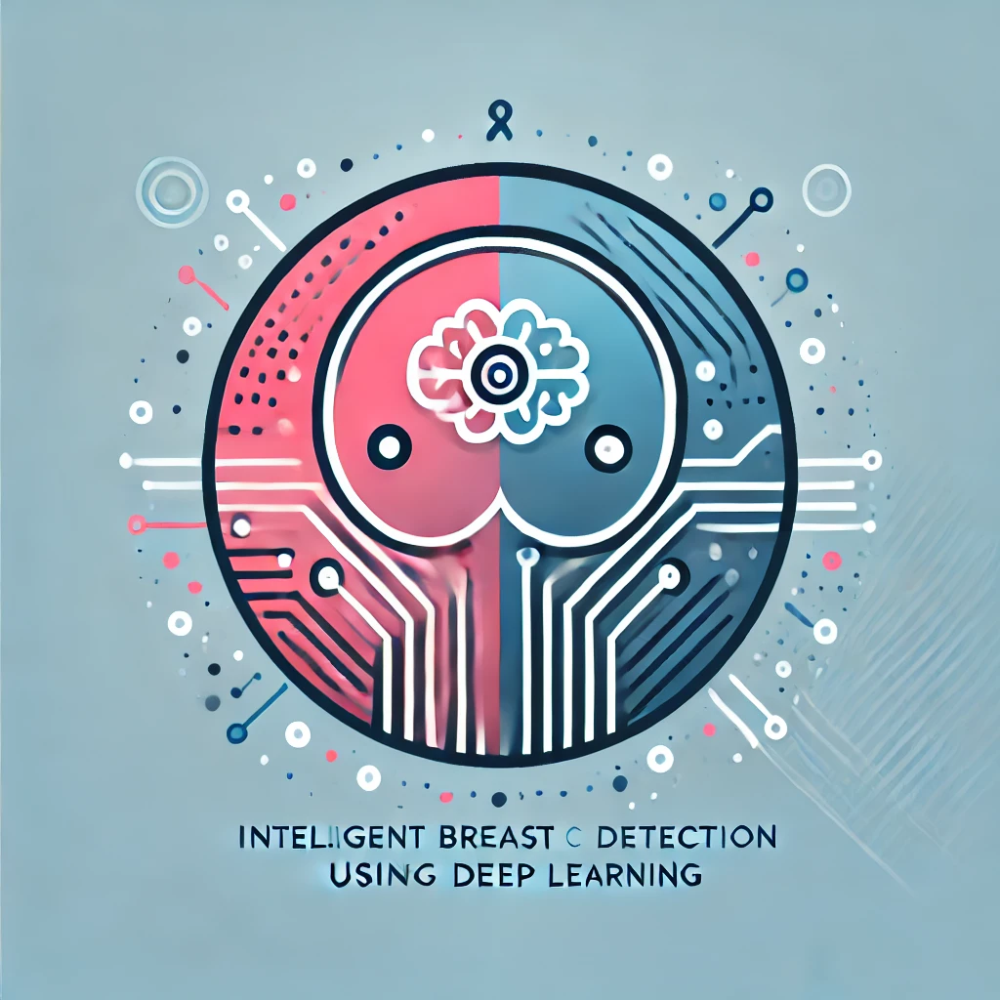

# MammoVision: Detección Inteligente de Cáncer de Mama mediante Deep Learning

<div align="center">
  
  <br>
  <p>
    <a href="#descripción">Descripción</a> •
    <a href="#características">Características</a> •
    <a href="#instalación">Instalación</a> •
    <a href="#uso">Uso</a> •
    <a href="#tecnologías">Tecnologías</a> •
    <a href="#equipo">Equipo</a>
  </p>
</div>

## 🏫 Institución

**Universidad Autónoma Gabriel René Moreno**  
Facultad de Ingeniería en Ciencias de la Computación y Telecomunicaciones (FICCT)  
Feria Facultativa de Proyectos de Investigación  
Gestión 2-2024

## 📋 Descripción

MammoVision es un sistema de vanguardia que utiliza Deep Learning para la detección y segmentación precisa de lesiones mamarias en imágenes mamográficas. El sistema emplea YOLOv11-seg para clasificar lesiones como benignas o malignas con alta precisión, proporcionando una herramienta valiosa para el diagnóstico temprano.

## ✨ Características

- **Detección en Tiempo Real**: Análisis instantáneo de mamografías con resultados precisos
- **Segmentación Precisa**: Identificación exacta de lesiones con YOLOv11-seg
- **Interfaz Intuitiva**: Diseño centrado en profesionales médicos
- **Multi-formato**: Soporte para DICOM, PNG, JPEG y TIFF

## 🚀 Instalación

### Prerrequisitos

```bash
Node.js 18.0 o superior
```


### Configuración
1. Clonar el repositorio:


```bash
git clone https://github.com/sm-nunez404/mammovision.git
cd mammovision/mammovision-frontend
```

2. Instalar dependencias:


```bash
npm install
```


## 💻 Uso:


```bash
npm run dev
```


La aplicación estará disponible en `http://localhost:3000`

## 🛠️ Tecnologías

- Next.js 14
- React
- TailwindCSS
- TypeScript

## 📊 Métricas de Rendimiento

- mAP@50: 0.485
- mAP@[50:95]: 0.315
- Precisión (Maligno): 0.545
- Recall (Maligno): 0.571

## 👥 Equipo

### Autores
- **Mauricio Núñez** - Desarrollo Principal - [@sm-nunez404](https://github.com/sm-nunez404) - [LinkedIn](https://www.linkedin.com/in/smnunez404/)
- **Silvia Colque** - Investigación y Desarrollo - [@silvia-colque](https://github.com/silvia-colque) - [LinkedIn](https://www.linkedin.com/in/colque-silvia-3825902b3/)
- **Keila Rojas** - Machine Learning - [@keila-rojas](https://github.com/keila-rojas) - [LinkedIn](https://www.linkedin.com/in/keila-rojas-213161329)
- **Elias Puma** - Frontend - [@elias-puma](https://github.com/elias-puma) - [LinkedIn](https://www.linkedin.com/in/elias-puma-3ab976281)

### Docente Tutor
- **Ing. Valentin Victor Flores Guzman**

## 📄 Licencia

Este proyecto está bajo la Licencia MIT - ver el archivo [LICENSE.md](LICENSE.md) para más detalles.

---

<div align="center">
  Desarrollado con ❤️ para la detección temprana del cáncer de mama
</div>


